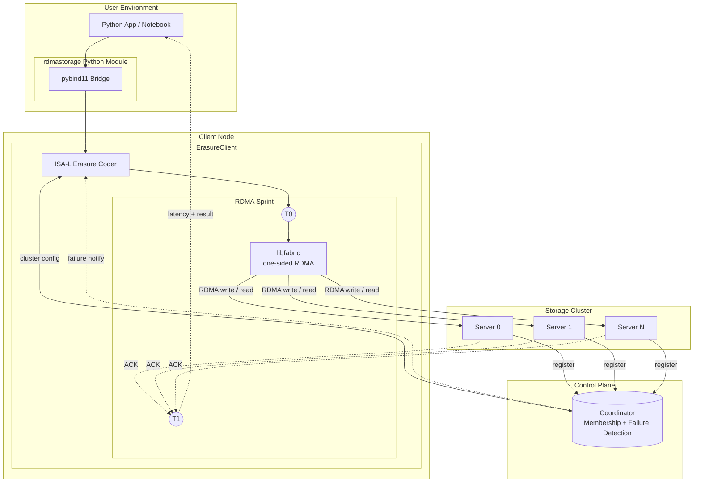

# RDMA-Distributed-KV-Store

An RDMA-backed distributed key-value store with Reed-Solomon erasure coding, built on libfabric (verbs/RoCE provider) and Intel ISA-L. Designed for CloudLab xl170 nodes.

---

## How It Works

Objects are erasure-coded before being written across a cluster of storage servers. Bulk data moves via one-sided RDMA (zero-copy), while only tiny control messages travel over two-sided messaging. A separate coordinator process handles cluster membership, k/m assignment, and failure detection.

**PUT path:**
1. Client encodes the object into `k` data shards + `m` parity shards using Reed-Solomon (ISA-L).
2. For each shard, client sends a `PutRequest` control message to the corresponding server.
3. Server allocates a slot in its RDMA pool and replies with a `SlotGrant` (remote address + rkey).
4. Client performs an RDMA write of the shard directly into the server's registered memory — no server CPU involved.
5. Client sends a `PutCommit` to each server; server updates its key-to-slot index and sends an `Ack`.

**GET path:**
1. Client sends a `GetRequest` to each of the `k` servers holding data shards (or any `k` of `k+m` during degraded reads).
2. Each server replies with a `SlotInfo` (remote address + rkey + length).
3. Client performs RDMA reads of all shards in parallel.
4. Client decodes shards back into the original object (ISA-L).

**DELETE path:** Client sends a `DelRequest` to each server; server frees the slot and its pool memory.

---

## Architecture



### Coordinator

A plain TCP server on port 7777. Responsibilities:

- Maintains the list of alive servers, each with a registration index and fabric address.
- Computes `k` and `m` from the number of alive nodes (`m = n/3`, `k = n - m`).
- Sends `PING` to each server every 2 seconds over the persistent registration TCP connection; declares a server dead after 3 consecutive missed pings (~6 s total).
- On failure, broadcasts `DEAD <idx>` to all connected client watch sockets immediately.
- Responds to client `LIST` requests with the current cluster layout (server addresses + k/m).

### Server

One process per storage node. Responsibilities:

- Registers a 512 MB `mmap` slab with libfabric as an RDMA-accessible memory region (MR).
- Manages free/used slots in that slab via a first-fit free-list allocator (`PoolAlloc`).
- Handles control messages over two-sided RDMA sends/recvs:
  - `PutRequest` → allocates a slot, returns `SlotGrant` (remote addr + rkey)
  - `PutCommit` → records key→slot in an `unordered_map`, acks
  - `GetRequest` → looks up slot by key, returns `SlotInfo`
  - `DelRequest` → deletes the key from the map, frees the slot back to the pool
- After `SlotGrant`, the server's CPU is idle — the client writes the shard directly via RDMA.

### Client Library (`client_lib.hpp`)

`ErasureClient` holds:
- One `ServerConn` per server (registered control + data buffers, connected RDMA endpoint).
- An `ErasureCoder` (ISA-L Reed-Solomon) with the current `k`/`m`.
- A background watcher thread that listens for `DEAD` notifications from the coordinator and sets per-server dead flags atomically.
- `PhaseTimes` structs for the last PUT and GET, enabling latency attribution without external tracing.

**Degraded reads:** If fewer than `k` servers are alive, GET fails. When exactly `k` are alive (some dead), GET skips dead servers and issues RDMA reads to the surviving shards, then uses ISA-L's `ec_encode_decode` to reconstruct missing shards before decoding.

### Erasure Coding (`ec.hpp`)

Wraps Intel ISA-L's Reed-Solomon implementation:
- Cauchy matrix generation (`gf_gen_cauchy1_matrix`) for MDS codes.
- `Encode`: splits an object into `k` data fragments + `m` parity fragments.
- `Decode`: reconstructs the original object from any `k` of `k+m` fragments.
- Shard size is rounded up to a 64-byte boundary for ISA-L SIMD alignment.

### RDMA Transport (`common.hpp`)

Thin libfabric abstraction over `FI_EP_MSG` (connection-oriented) endpoints:

- `Network`: opens a fabric + domain, provides `Listen()`/`Accept()` (server) and `Connect()` (client).
- `Connection`: wraps one endpoint + CQ. Exposes `PostRecv`, `PostSend`, `PostWrite`, `PostRead` with completion callbacks, and a `Poll()` event loop.
- Memory registration is split: control buffers use `FI_SEND|FI_RECV`; data buffers use `FI_REMOTE_READ|FI_REMOTE_WRITE` to allow client-initiated one-sided ops.
- Supports both virtual-address MR mode (`FI_MR_VIRT_ADDR`) and offset-based MR mode, detected at runtime from the provider's capabilities.

---

## File Structure

```
RDMA-Distributed-KV-Store/
├── src/
│   ├── common.hpp        # libfabric Network/Connection abstraction, Buffer, RDMA ops
│   ├── protocol.hpp      # wire message structs (PutRequest, SlotGrant, GetRequest, etc.)
│   ├── ec.hpp            # ISA-L Reed-Solomon encode/decode wrapper
│   ├── client_lib.hpp    # ErasureClient: PUT/GET/DELETE logic, phase timers, watcher thread
│   ├── coordinator.cpp   # cluster coordinator: registration, k/m, failure detection
│   ├── server.cpp        # storage server: RDMA pool, slot allocator, key index
│   ├── client.cpp        # CLI benchmark/file client (uses ErasureClient)
│   └── rdmastorage.cpp   # pybind11 Python module (wraps ErasureClient)
│
├── build/                # compiled artifacts (gitignored)
│   ├── coordinator
│   ├── server
│   ├── client
│   └── rdmastorage*.so   # Python extension module
│
├── scripts/
│   └── install_ubuntu.sh # one-shot dependency + build script for Ubuntu 22.04
│
├── bench_latency.py      # latency sweep (256B → 1MB)
├── bench_phases.py       # per-phase breakdown for a single size
├── bench_workload.py     # configurable workloads (put_only/get_only/put_get/put_get_delete)
├── test_rdmastorage.py   # correctness smoke tests
├── failure_demo.py       # live failure detection + degraded read demo
├── demo.ipynb            # Jupyter notebook walkthrough
│
├── Makefile
├── USAGE.md              # startup instructions and API reference
└── README.md             # this file
```

---

## k/m Assignment

The coordinator picks `k` and `m` automatically from the number of alive servers (`m = n/3`, `k = n - m`). Any `k` of `k+m` shards are sufficient to reconstruct an object.

| Servers | k | m | Tolerates |
|---------|---|---|-----------|
| 2       | 2 | 0 | 0 failures |
| 3       | 2 | 1 | 1 failure  |
| 4       | 3 | 1 | 1 failure  |
| 5       | 4 | 1 | 1 failure  |
| 6       | 4 | 2 | 2 failures |
| 7       | 5 | 2 | 2 failures |
| 8       | 6 | 2 | 2 failures |
| 9       | 6 | 3 | 3 failures |

---

## Build

**Dependencies:** libfabric (verbs provider), rdma-core / libibverbs, Intel ISA-L, pybind11 (for Python module).

```bash
# Ubuntu 22.04 — install everything and build
bash scripts/install_ubuntu.sh

# Or manually
make -j          # builds server, client, coordinator → build/
make pymod       # builds build/rdmastorage*.so
```

The Makefile links against system libfabric by default (`FABRIC_PREFIX=/usr`). Override for EFA or a custom install:

```bash
make FABRIC_PREFIX=/opt/amazon/efa
```

---

## Quick Start

```bash
# node0
./build/coordinator

# node1, node2, ... (each node)
./build/server --coord node0

# Any node — Python client
python3 - <<'EOF'
import sys; sys.path.insert(0, 'build')
import rdmastorage
c = rdmastorage.Client('node0')
print(f'k={c.k}  m={c.m}')
c.put('hello', b'world')
print(c.get('hello'))
EOF
```

See `USAGE.md` for the full API reference, CLI modes, benchmarks, and failure demo instructions.

---

## Latency Phase Breakdown

The Python client exposes per-phase timers so RDMA wire time can be isolated from software overhead:

```
PUT 64KB
  encode      ~12 us   (ISA-L Reed-Solomon)
  ctrl RTT    ~49 us   (PutRequest → SlotGrant over two-sided RDMA)
  RDMA write ~242 us   (one-sided write → CQ completion)  ← wire latency
  commit RTT  ~10 us   (PutCommit → Ack)
  total      ~313 us

GET 64KB
  ctrl RTT    ~38 us   (GetRequest → SlotInfo)
  RDMA read  ~152 us   (one-sided read → CQ completion)   ← wire latency
  decode       ~8 us   (ISA-L reconstruct)
  total      ~198 us
```

Run `bench_workload.py` (or `bench_phases.py`) on a live cluster to collect real numbers.
